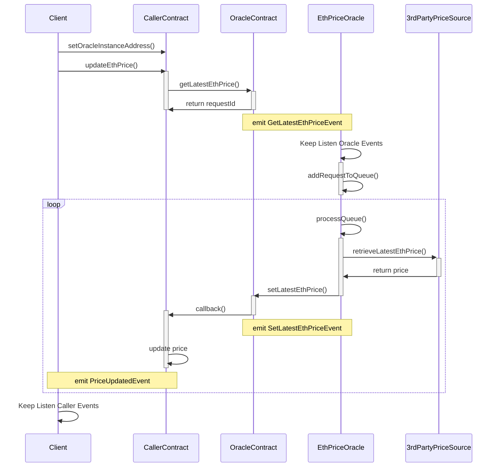

# How to Build an Oracle

## First things first

- 初始化 NPM

    ```bash
    $npm init -y
    ```

- 安裝需要的 package 們 (Crypto Zombies 教學中裝的 package 有的蠻老舊了，不用照著裝)

    ```bash
    $npm install @openzeppelin/contracts bn.js axios fs web3
    ```

## 檔案目錄

```bash
.
├── Client.js
├── EthPriceOracle.js
├── README.md
├── caller
│   ├── CallerContract.sol
│   ├── EthPriceOracleInterface.sol
│   ├── artifacts
│   └── caller_private_key
├── oracle
│   ├── CallerContractInterface.sol
│   ├── EthPriceOracle.sol
│   ├── artifacts
│   └── oracle_private_key
├── package-lock.json
├── package.json
├── scripts
│   └── gen-key.js
└── utils
    └── common.js

```

## 角色與流程


